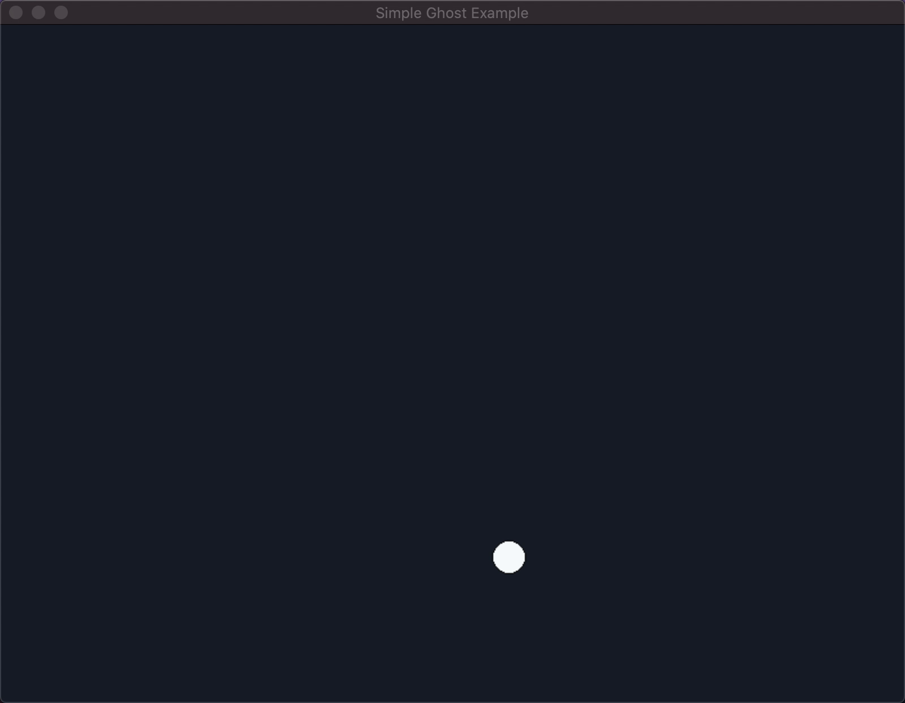

<p align="center"></p>
<p align="center"></p>

## About Engine
Engine is a simple framework to make 2D games in Ghost.

## Status
Currently messing around with SDL and experimenting on what the API should look like.

## Requirements
- SDL2
- SDL2_image

Requirements can be installed through brew on Mac:

```
$ brew install sdl2 sdl2_image
```

## Notes
- Engine should come with a set of built-in "modules" to interact with and configure various aspects of the framework and game.
    - Audio

        The `Audio` module lets you play audio files such as music or sound effects.
    - Engine

        The `Engine` module allows you to control and configure various aspects of hoe Engine as an application operates.
    - Window

        The `Window` module provides utilities for retrieving and setting the state of the game window.
    - Graphics

        The `Graphics` module provides utilities for drawing to the screen.
    - Keyboard

        The `Keyboard` module allows you to retrieve the state of the keyboard.
    - Mouse

        The `Mouse` module allows you to retrieve the state of the mouse.
    - Controller

        The `Controller` module allows you to retrieve the state of game controllers.

### Built In Functions
#### `load()`
Called only once before the game loop begins. This is where you would want to pre-load any resources, initialize variables, and configure settings. While its possible to perform these actions elsewhere in your code, its generally a better idea to do so here as its not called at every frame.

#### `update()`
Called continuously where calculations and other deterministic factors should be performed.

#### `draw()`
Much like `update`, this function is called continuously, allowing you to draw and update the screen.

## Acknowledgements & Resources
- **[Dome](https://domeengine.com/)** for the inspiration.
- **[Love2D](https://love2d.org/)** for the inspiration.
- **[Pico 8](https://www.lexaloffle.com/pico-8.php)** for the inspiration.
- **[SDL2](https://github.com/veandco/go-sdl2)** for audio, keyboard, mouse, joystick, and graphics hardware support.
- **[go-sdl2](https://github.com/veandco/go-sdl2)** for the Go-specific SDL2 bindings.
- **[Silver](https://poppyworks.itch.io/silver)** for the multi-lingual pixel font.